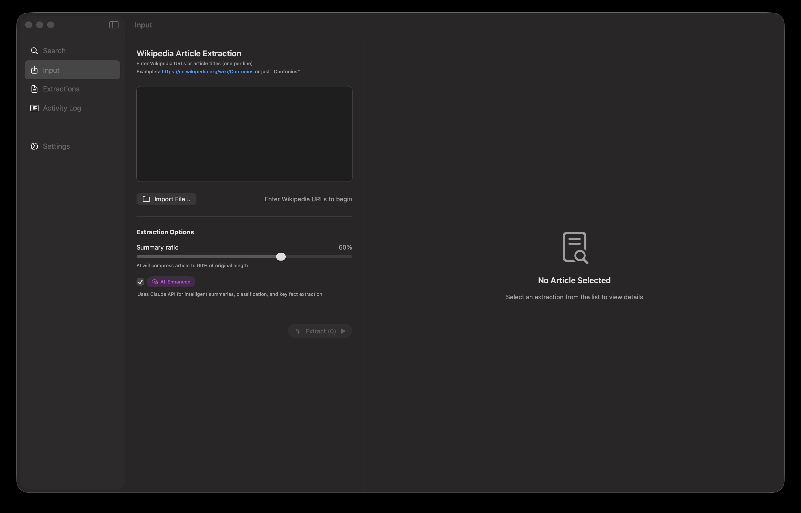
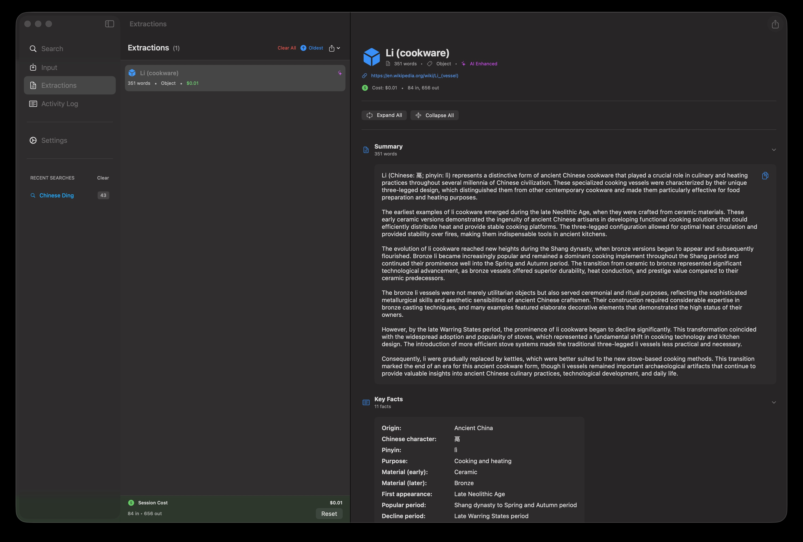
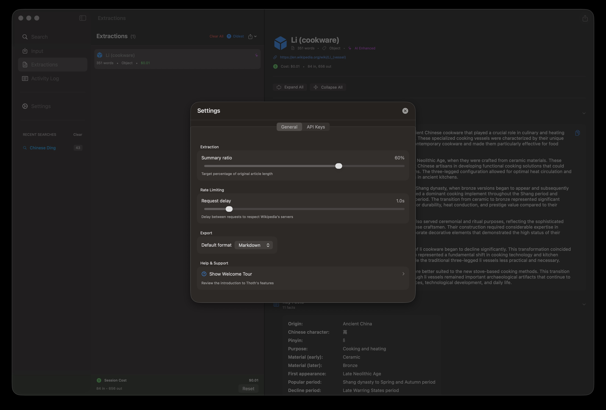

<p align="center">
  
</p>

<h1 align="center">Thoth</h1>

<p align="center">
  <strong>AI-Powered Wikipedia Discovery & Extraction</strong>
</p>

<p align="center">
  A native macOS application that uses Claude AI to discover, extract, and transform Wikipedia articles into structured, intelligent knowledge.
</p>

<p align="center">
  
  
  
  
</p>

---

## ✨ What's New in v2.0.0

### 🔍 AI-Powered Search
Discover Wikipedia articles using natural language. Search for "ancient Rome" or describe what you're looking for — Claude AI finds relevant articles automatically.

### 🎓 Welcome Wizard
New users are greeted with a beautiful 6-slide onboarding experience that introduces Thoth's capabilities and guides them through setup.

### 🎨 Refined Interface
Polished UI with standardized navigation, improved badges, and seamless integration between Search and Extraction workflows.

---

## Why Thoth?

**Thoth** brings AI-powered Wikipedia discovery and extraction to your Mac. Whether you're building a knowledge base, researching a topic, or creating training data — Thoth helps you find, extract, and export Wikipedia content intelligently.

- 🔍 **AI Discovery** — Find relevant articles using natural language queries
- 📚 **Smart Extraction** — Extract any Wikipedia article by URL or title
- 🧠 **AI Summarization** — Compress articles while preserving key information
- 📦 **Batch Processing** — Queue up to 200 articles and process them all at once
- 📊 **Structured Data** — Automatically extract facts, dates, locations, and topics
- 💰 **Cost Transparent** — Know exactly what you'll pay before processing
- 🔒 **Private & Secure** — API keys stored in your Mac's Keychain

---

## Screenshots

<table>
  <tr>
    <td width="50%">
      <strong>Search</strong><br>
      <em>Discover articles with AI-powered natural language search</em><br><br>
      
    </td>
    <td width="50%">
      <strong>Input</strong><br>
      <em>Add Wikipedia URLs and configure extraction options</em><br><br>
      
    </td>
  </tr>
  <tr>
    <td width="50%">
      <strong>Extraction</strong><br>
      <em>View extracted content with summaries, facts, and more</em><br><br>
      
    </td>
    <td width="50%">
      <strong>Settings</strong><br>
      <em>Configure preferences and access the Welcome Tour</em><br><br>
      
    </td>
  </tr>
</table>

<p align="center">
  <strong>Markdown Export</strong><br>
  <em>Clean, structured output ready for notes, documentation, or AI training</em><br><br>
  
</p>

---

## Getting Started

### 1. Download & Install

Download the latest release from the [Releases](https://github.com/trodelli/Thoth/releases) page:

1. Download `Thoth-2.0.0.dmg`
2. Open the DMG and drag **Thoth** to your Applications folder
3. Launch Thoth — the Welcome Wizard will guide you through setup

> **First Launch Note:** macOS may show a security warning for apps downloaded outside the App Store. Go to **System Settings → Privacy & Security** and click **"Open Anyway"**.

### 2. Get Your API Key

Thoth uses [Claude AI](https://www.anthropic.com/claude) by Anthropic for intelligent search and extraction:

1. Visit the [Anthropic Console](https://console.anthropic.com/settings/keys) (link also available in Settings)
2. Create an account and generate an API key
3. Paste the key into Thoth Settings → API Keys

### 3. Discover & Extract

**Option A: Search for Articles**
1. Go to the **Search** tab
2. Enter keywords or describe what you're looking for
3. Review AI-curated results with descriptions
4. Select articles and click **"Add to Input"**
5. Extract them all at once

**Option B: Direct Extraction**
1. Go to the **Input** tab
2. Enter a URL or title — `https://en.wikipedia.org/wiki/Confucius` or just `Confucius`
3. Enable **AI Enhancement** for intelligent summarization
4. Click **Extract**

---

## Features

### 🔍 AI-Powered Search

Thoth's intelligent search uses Claude AI to discover Wikipedia articles:

- **Natural Language** — Search by keyword or describe what you need
- **Article Validation** — Every result is verified to exist on Wikipedia
- **Rich Previews** — See descriptions and preview content before extracting
- **Batch Selection** — Select multiple articles and add them all to extraction
- **Export Results** — Save search results as TXT, Markdown, or JSON
- **Recent Searches** — Quick access to previous searches in the sidebar

<p align="center">
  
</p>

### 📚 AI-Powered Extraction

Thoth uses Claude Sonnet 4 to intelligently process Wikipedia articles:

- **Smart Summarization** — Compress to 40-70% of original length
- **Article Classification** — Automatically categorize (Person, Place, Event, etc.)
- **Key Facts** — Extract the most important information
- **Temporal Context** — Identify important dates and events
- **Geographic Context** — Extract locations with modern equivalents
- **Related Topics** — Discover connected subjects

### 📦 Batch Processing

Process multiple articles efficiently:

- Add up to 200 URLs at once
- Real-time progress tracking for each article
- Global progress banner shows overall status
- Rate limiting respects Wikipedia's servers
- Session cost tracking

### 📤 Export Options

| Format | Use Case |
| --- | --- |
| **Markdown** | Perfect for notes, Obsidian, or documentation |
| **JSON** | Ideal for data processing or LLM training |

Export options:
- **Single Article** — Export one extraction (⌘E)
- **All to Folder** — Export each as separate file (⌘⇧E)
- **Session to File** — Combine all into one document (⌘⌥E)

### 🎓 Welcome Wizard

New to Thoth? The Welcome Wizard introduces you to all features:

- **6 informative slides** covering Search, Input, AI Enhancement, and Export
- **Automatic first-launch** detection
- **Quick actions** to add your API key or start exploring
- **Re-accessible** anytime from Settings or Help menu

---

## Pricing

Thoth itself is **free and open source**. You only pay for Claude API usage:

| Articles | Estimated Cost |
| --- | --- |
| 1 search query | ~$0.01-0.02 |
| 1 extraction | ~$0.02-0.05 |
| 10 extractions | ~$0.20-0.50 |
| 100 extractions | ~$2.00-5.00 |

Cost varies by article length. Built-in cost tracking shows your session total.

---

## Keyboard Shortcuts

| Action | Shortcut |
| --- | --- |
| New Extraction | `⌘N` |
| Show Search | `⌘1` |
| Show Input | `⌘2` |
| Show Extractions | `⌘3` |
| Show Activity Log | `⌘4` |
| Settings | `⌘,` |
| Export Current | `⌘E` |
| Export All to Folder | `⌘⇧E` |
| Export Session | `⌘⌥E` |
| Clear All | `⌘K` |

---

## Building from Source

Prefer to build it yourself? Easy:

```bash
git clone https://github.com/trodelli/Thoth.git
cd Thoth
open Thoth.xcodeproj
```

Then press `⌘R` in Xcode to build and run.

**Requirements:**
- macOS 14.0 (Sonoma) or later
- Xcode 15.0+

---

## How It Works

```
┌─────────────┐     ┌─────────────┐     ┌─────────────┐
│   Search    │ ──▶ │  Claude AI  │ ──▶ │  Validated  │
│   Query     │     │  Discovery  │     │  Articles   │
└─────────────┘     └─────────────┘     └──────┬──────┘
                                               │
                                               ▼
┌─────────────┐     ┌─────────────┐     ┌─────────────┐
│  Wikipedia  │ ──▶ │   Parse &   │ ──▶ │  Claude AI  │
│     URL     │     │   Extract   │     │  Analysis   │
└─────────────┘     └─────────────┘     └──────┬──────┘
                                               │
┌─────────────┐     ┌─────────────┐            │
│   Export    │ ◀── │  Structured │ ◀──────────┘
│   MD/JSON   │     │    Data     │     Summary, Facts,
└─────────────┘     └─────────────┘     Dates, Locations
```

1. **Search** — Describe what you're looking for (or skip to step 3)
2. **Discover** — Claude AI finds relevant Wikipedia articles
3. **Input** — Enter Wikipedia URLs or article titles
4. **Fetch** — Download article content from Wikipedia API
5. **Parse** — Extract HTML content and structure
6. **Analyze** — Claude AI generates summaries and extracts data
7. **Display** — Browse results in collapsible sections
8. **Export** — Save to Markdown or JSON

---

## Tech Stack

| Component | Technology |
| --- | --- |
| UI Framework | SwiftUI |
| Architecture | MVVM |
| AI | Claude Sonnet 4 (Anthropic) |
| Networking | URLSession + async/await |
| Security | macOS Keychain Services |
| HTML Parsing | Custom Swift parser |

---

## Project Structure

```
Thoth/
├── App/                    # App entry point
├── Configuration/          # Constants and settings
├── Models/                 # Data models
├── Services/
│   ├── AI/                # Claude integration + Search
│   ├── Extraction/        # Extraction engine
│   ├── Export/            # Export functionality
│   └── Wikipedia/         # Wikipedia API
├── Utilities/             # Helpers
├── ViewModels/            # State management
└── Views/
    ├── Components/        # Reusable UI
    ├── Extraction/        # Extraction views
    ├── Input/             # Input view
    ├── Logs/              # Activity log
    ├── Onboarding/        # Welcome Wizard
    ├── Search/            # Search views
    └── Settings/          # Settings view
```

---

## Contributing

Contributions are welcome! Here's how:

1. Fork the repository
2. Create a feature branch (`git checkout -b feature/amazing-idea`)
3. Commit your changes (`git commit -m 'Add amazing idea'`)
4. Push to the branch (`git push origin feature/amazing-idea`)
5. Open a Pull Request

---

## License

MIT License — see [LICENSE](LICENSE) for details.

Free to use, modify, and distribute.

---

## Acknowledgments

- [Anthropic](https://www.anthropic.com) for Claude AI
- [Wikipedia](https://www.wikipedia.org) via the Wikimedia API
- Named after [Thoth](https://en.wikipedia.org/wiki/Thoth) — the ancient Egyptian god of knowledge and writing

---

<p align="center">
  <strong>DESIGNED BY THEWAY.INK · BUILT WITH AI · MADE IN MARSEILLE</strong>
</p>

<p align="center">
  <a href="https://github.com/trodelli/Thoth/releases">Download</a> ·
  <a href="https://github.com/trodelli/Thoth/issues">Report Bug</a> ·
  <a href="https://github.com/trodelli/Thoth/issues">Request Feature</a>
</p>
